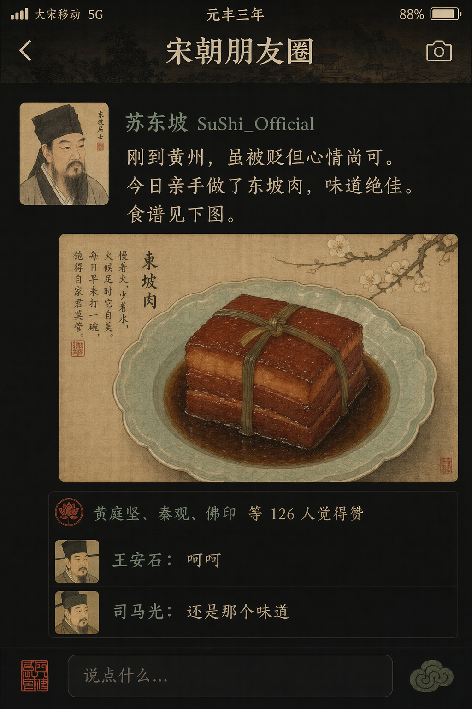
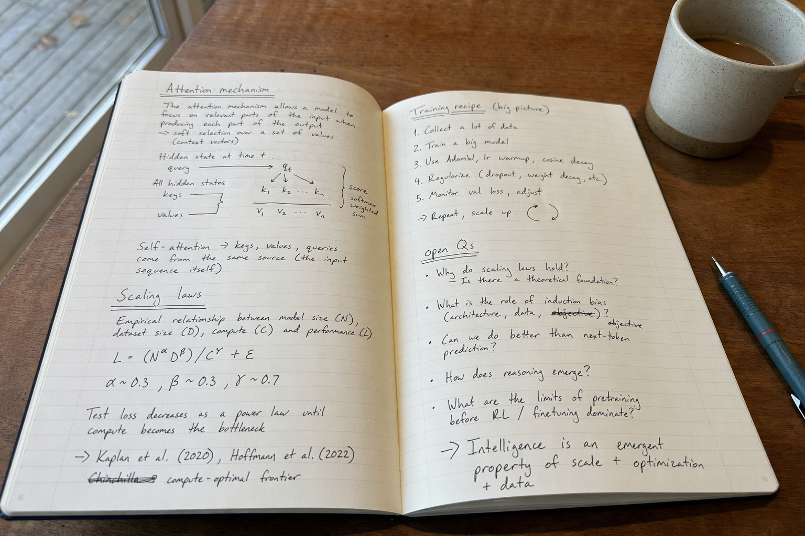

# gpt-2-image-skill

A portable **Agent Skill + CLI** for OpenAI **GPT Image 2** (`gpt-image-2`). Works with Claude Code, Codex CLI, OpenCode, Cursor Agent, Aider, and plain shell — anywhere you can run `uv`.

Comes with a curated prompt gallery for the hard stuff: dense Chinese typography, photorealism, posters, infographics, character sheets, research-paper figures, image editing.


---

## 1. Skill Quick Start

Once installed, invoke the skill with the same slash command in any SKILL.md-aware agent:

```
/gpt-image a photorealistic convenience store at 10pm, 1024x1024

/gpt-image Design a 3:4 tea poster with exact Chinese copy
"山川茶事" / "冷泡系列" / "中杯 16 元" / "大杯 19 元"

/gpt-image colorize ./fig/manga-page.jpg and translate the text to Chinese

/gpt-image combine fig/cat.png and fig/kfc_logo.png into a collab poster
```

Compatible with:

- **Claude Code**
- **Codex**
- **OpenCode**
- Any SKILL.md-aware runtime

### Tips

- Put displayed text in **quotes** — agents preserve it verbatim.
- State **aspect / size** upfront (`3:4`, `2K`, `landscape`, `portrait`, `4K`).
- Name a **reference image path** to flip to edit mode; add a **mask** for inpainting.
- Default `--quality` is `high` — say "use quality low" for cheap iteration.

---

## 2. Install

### Option A — Skill-aware agent (auto-discovery)

```bash
git clone https://github.com/wuyoscar/gpt_image_2_skill ~/.claude/skills/gpt-image
export OPENAI_API_KEY=sk-...
```

Restart the agent and it will surface the skill on any image-gen intent.

| Runtime | Install path |
|---|---|
| Claude Code | `~/.claude/skills/<name>/SKILL.md` |
| Claude.ai Skills | upload `.zip` of this repo via the UI |
| OpenCode / Hermes | check the project docs for their skills dir |

### Option B — Standalone CLI anywhere

```bash
git clone https://github.com/wuyoscar/gpt_image_2_skill ~/tools/gpt-image
export OPENAI_API_KEY=sk-...
uv run ~/tools/gpt-image/scripts/generate.py -p "a cat astronaut"
```

Requires `uv` and Python ≥ 3.11. Dependencies (`httpx`, `python-dotenv`) auto-install on first run via PEP 723 inline metadata — no pip install, no venv.

---

## 3. Showcase

All images produced one-shot at `--quality high`. Every prompt is in [`references/gallery.md`](references/gallery.md); captions below credit the original source so you can trace it.

### Chinese typography & posters

<table>
<tr>
<td width="50%" valign="top"><br><em>Chinese tea-launch poster · community (<a href="https://mp.weixin.qq.com/s/ASxig6mFVYxrIE8-8Fthew">卡尔的AI沃茨</a>)</em></td>
<td width="50%" valign="top"><br><em>1980s propaganda poster · community (<a href="https://x.com/akokoi1/status/2046558658096738672">@akokoi1</a>) + adapted</em></td>
</tr>
<tr>
<td valign="top"><br><em>Museum-catalog infographic (唐代襦裙) · community (<a href="https://x.com/MrLarus/status/2045504669401653414">@MrLarus</a>)</em></td>
<td valign="top"><br><em>Song Dynasty social-media feed (宋朝朋友圈) · community (<a href="https://x.com/Panda20230902/status/2045385588065313057">@Panda20230902</a>)</em></td>
</tr>
</table>

### Editorial & design posters

<table>
<tr>
<td width="50%" valign="top"><br><em>Saul-Bass-style thriller poster · original (Bass lineage)</em></td>
<td width="50%" valign="top"><br><em>Manga relationship map — <em>A Tale of Two Cities</em> · community (<a href="https://x.com/cht0001/status/2046920121239908380">@cht0001</a>)</em></td>
</tr>
</table>

### Infographics & field guides

<table>
<tr>
<td colspan="2" align="center" valign="top"><br><em>Encyclopedia field guide (Giant Panda) · community (<a href="https://x.com/MrLarus/status/2046231542817497392">@MrLarus</a>)</em></td>
</tr>
</table>

### Product & food photography

<table>
<tr>
<td width="50%" valign="top"><br><em>Chocolate wafer product render (JSON-style) · community (<a href="https://x.com/mehvishs25/status/2020693181730598932">@mehvishs25</a>)</em></td>
<td width="50%" valign="top"><br><em>Salad-explosion food photo (JSON-style) · community (<a href="https://x.com/ChillaiKalan__">@ChillaiKalan__</a>)</em></td>
</tr>
</table>

### Gaming landscapes

<table>
<tr>
<td width="50%" valign="top"><br><em>Hitman gameplay — OpenAI HQ · community (<a href="https://x.com/flowersslop/status/2044734896321532390">@flowersslop</a>)</em></td>
<td width="50%" valign="top"><br><em>GTA 6 gameplay — Vice City beach · community (<a href="https://x.com/WolfRiccardo/status/2041187268711321735">@WolfRiccardo</a>)</em></td>
</tr>
</table>

### Photorealism & reportage

<table>
<tr>
<td width="50%" valign="top"><br><em>RAW iPhone — 42nd Street subway · community (<a href="https://x.com/WolfRiccardo/status/2041192232623972441">@WolfRiccardo</a>)</em></td>
<td width="50%" valign="top"><br><em>Handwritten notebook flatlay · community (<a href="https://x.com/patrickassale/status/2044569086013718958">@patrickassale</a>)</em></td>
</tr>
<tr>
<td valign="top"><br><em>Chess board mid-game · community (<a href="https://x.com/EddGorenstein/status/2046923077993259196">@EddGorenstein</a>)</em></td>
<td valign="top"><br><em>360° equirectangular panorama · community (<a href="https://x.com/AIimagined/status/2046915800263802880">@AIimagined</a>)</em></td>
</tr>
</table>

### Cinematic & animation

<table>
<tr>
<td width="50%" valign="top"><br><em>Pixar-style 3D still (kitten + soufflé) · community style pattern</em></td>
<td width="50%" valign="top"><br><em>1940s film-noir still · original (Alton / Toland lineage)</em></td>
</tr>
<tr>
<td colspan="2" align="center" valign="top"><br><em>Professional 6-panel storyboard (Tokyo rooftop chase) · original</em></td>
</tr>
</table>

### Character design

<table>
<tr>
<td colspan="2" align="center" valign="top"><br><em>Cyberpunk engineer reference sheet · community (<a href="https://x.com/MANISH1027512/status/2045013913901867334">@MANISH1027512</a>)</em></td>
</tr>
<tr>
<td colspan="2" align="center" valign="top"><br><em>16-panel anime expression grid · community (<a href="https://mp.weixin.qq.com/s/ASxig6mFVYxrIE8-8Fthew">卡尔的AI沃茨</a>)</em></td>
</tr>
</table>

### Research paper figures

<table>
<tr>
<td width="50%" valign="top"><br><em>Transformer encoder–decoder · Vaswani et al., 2017</em></td>
<td width="50%" valign="top"><br><em>Retrieval-Augmented Generation pipeline · Lewis et al., 2020</em></td>
</tr>
<tr>
<td valign="top"><br><em>Multi-agent LLM system · AutoGen (Wu et al., 2023) / LangGraph / Managed Agents</em></td>
<td valign="top"><br><em>Denoising diffusion forward / reverse chain · Ho et al., 2020</em></td>
</tr>
<tr>
<td valign="top"><br><em>Empirical scaling laws · Kaplan 2020, Chinchilla (Hoffmann et al., 2022)</em></td>
<td valign="top"><br><em>Benchmark comparison heatmap · HELM (Liang et al., 2023)</em></td>
</tr>
<tr>
<td valign="top"><br><em>Ablation bar chart · generic reasoning-paper layout</em></td>
<td valign="top"><br><em>LLM pretraining data-mixture sankey · GPT-3 / LLaMA / Pile compositions</em></td>
</tr>
<tr>
<td valign="top"><br><em>Multi-head attention heatmaps · Clark et al., 2019</em></td>
<td valign="top"><br><em>Frontier LLM lineage, 2018–2026 · community survey format</em></td>
</tr>
<tr>
<td colspan="2" align="center" valign="top"><br><em>ReAct reasoning trace · Yao et al., 2022</em></td>
</tr>
</table>

---

## Acknowledgements

This skill stands on the shoulders of the GPT Image 2 creator community. Every showcase image credits its source inline; consolidated list below.

**Upstream model**
- **OpenAI** — the `gpt-image-2` model itself (`/v1/images/generations`, `/v1/images/edits`).

**Prompt-gallery upstream**
- [`ZeroLu/awesome-gpt-image`](https://github.com/ZeroLu/awesome-gpt-image) — 56 community-curated editorial prompts, CC BY 4.0; per-entry `@handle` attribution preserved in [`references/gallery.md`](references/gallery.md).
- [`ResearAI/AutoFigure`](https://github.com/ResearAI/AutoFigure) — related project on LLM-based scientific figure generation (different architecture: review-refine loop).

**Community creators cited per-image**
- [卡尔的AI沃茨 (WeChat)](https://mp.weixin.qq.com/s/ASxig6mFVYxrIE8-8Fthew) — tea poster, music player, e-commerce app, 16-panel anime expression grid
- [@MrLarus](https://x.com/MrLarus) — museum-catalog infographic, encyclopedia field guide, GTA 6 template, character relationship diagrams
- [@akokoi1](https://x.com/akokoi1) — 1980s propaganda poster
- [@Panda20230902](https://x.com/Panda20230902) — Song Dynasty social-media feed
- [@flowersslop](https://x.com/flowersslop) — Hitman / OpenAI HQ gameplay, GTA San Andreas
- [@WolfRiccardo](https://x.com/WolfRiccardo) — GTA 6 gameplay, RAW iPhone subway
- [@patrickassale](https://x.com/patrickassale) — handwritten notebook photo, Apple Park keynote
- [@EddGorenstein](https://x.com/EddGorenstein) — chess board mid-game
- [@AIimagined](https://x.com/AIimagined) — 360° equirectangular panorama
- [@mehvishs25](https://x.com/mehvishs25) — JSON-style product render
- [@ChillaiKalan__](https://x.com/ChillaiKalan__) — JSON-style food photography
- [@cht0001](https://x.com/cht0001) — manga relationship map for literature
- [@MANISH1027512](https://x.com/MANISH1027512) — character reference sheet format
- [@icreatelife](https://x.com/icreatelife) — 360° panorama + Codex 3D viewer workflow
- [@PANewsLab](https://x.com/PANewsLab) — Chinese person-profile poster template

**Research-figure paper inspirations** (each prompt in `references/gallery.md` cites the paper)
Vaswani et al. 2017 (Transformer) · Lewis et al. 2020 (RAG) · Ho et al. 2020 (DDPM) · Kaplan et al. 2020 / Hoffmann et al. 2022 (scaling laws / Chinchilla) · Madaan et al. 2023 (Self-Refine) · Clark et al. 2019 (BERT attention) · Yao et al. 2022 (ReAct) · Wu et al. 2023 (AutoGen) · Liang et al. 2023 (HELM) · Greshake et al. 2023 (indirect prompt injection)

---

## License

CC BY 4.0 — see [`LICENSE`](LICENSE).
